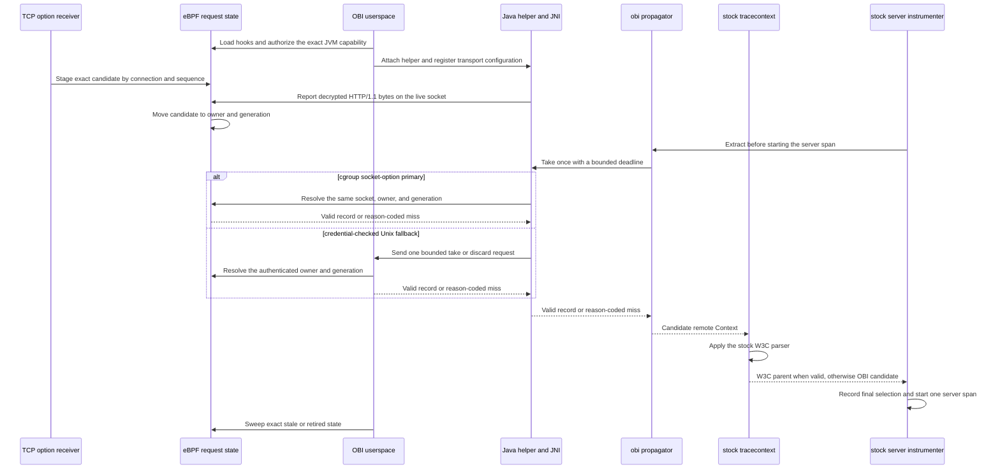

# Java remote-parent bridge

This document defines the version 1 result contract, version 3 fallback request,
and ownership model used to hand an inbound OBI TCP-propagated parent to an
unmodified OpenTelemetry-compatible Java agent. The bridge-parent scope is an
HTTP/1.1 server request received
through either the exact `SSLEngine` connection path used by the Netty PoC or
a stock-JSSE `SSLSocket` that directly owns its underlying socket descriptor.
Direct ownership requires `BaseSSLSocketImpl.self` to identify that same
`SSLSocket`, allowing the read and close advice to fence the descriptor with
one exact socket lifecycle. A layered JSSE socket that wraps a caller-owned raw
socket, or another ownership shape that cannot satisfy this identity, is
non-authoritative: it cannot select a bridge parent and records the fixed
`unsupported` receive outcome at most once for its physical lifecycle. HTTP/2
and other multiplexed protocols are not supported by this contract. The
contract also requires at most one HTTP/1.1 request ownership boundary per
decrypted plaintext emission. A per-connection framer carries split request
lines, headers, fixed bodies, chunk framing, and trailers across emissions.
Pipelined or coalesced requests that cross two ownership boundaries in one
emission are marked ambiguous and receive no bridge parent because one
callback cannot safely publish two independently extractable BPF generations.

The correctness invariant is strict: the bridge returns the parent owned by
the current request or no parent. It never returns a parent owned by another
request.

The packaged direct-JSSE fixture exercises real TLS 1.2 and, when the target
JSSE supports it, TLS 1.3 application reads and the Java receive lifecycle at
unprivileged component scope. It deliberately selects the disabled transport,
enables the receive path through a reflective test override, and reports both
`ebpf=not_asserted` and `native_ack=absent`. It therefore does not prove a
JNI/BPF acknowledgement, native retrieval, or official-agent server-span
parent and does not promote a kernel, transport, JVM, or agent compatibility
cell.

## Components and sequence

1. The sending OBI TCP option carries the exact trace ID, span ID, and trace
   flags of the outbound proxy span.
2. The receiving TCP sockops program validates and stages that candidate by
   connection. A second unconsumed candidate for the same connection marks the
   connection ambiguous instead of replacing the first candidate.
3. The existing Java TLS receive advice synchronously reports
   application-visible decrypted bytes before it returns them to the HTTP
   implementation. The directly owned JSSE path captures the exact socket
   lifecycle before each read. Instrumented `AppInputStream` and
   `ProxyInputStream` callbacks share one nested-read scope: only the outermost
   successful callback can emit its returned bytes, and every successful inner
   callback must name the same socket and lifecycle. A conflicting nested
   owner, EOF, or read failure poisons the exact lifecycle and fails closed;
   close makes that lifecycle unavailable before the descriptor can be reused.
   Layered and otherwise unsupported socket owners never emit a
   bridge-authoritative operation through a caller-owned descriptor. The
   `SSLEngine` path instead prefers the exact connection scoped by the current
   Netty operation. Both authoritative paths feed a
   serialized, bounded HTTP/1.1 framer. It emits `START` only after validating
   a complete request header, `CONTINUE` for later bytes owned by that request,
   and `RESET` when the exact sequence terminates without a usable handoff.
   Ambiguous streams are sticky and cannot select a parent. A provider-epoch
   transition permanently retires an established owner to telemetry-only
   operation. The generic `SocketChannel` fallback uses the exact `ByteBuffer`
   object from a verified positive read; it never derives ownership from
   attacker-controlled ciphertext. Duplicate and sliced buffer objects
   therefore miss rather than aliasing their backing storage. The weak,
   bounded identity map does not retain application buffers. Session-owner and
   marker caches likewise use bounded weak identity keys so custom TLS engines
   and their defining class loaders can be reclaimed. Capacity saturation
   rejects new identities; correlation fails closed and an unrecorded marker
   remains eligible for retry. Marker attempts are reserved atomically against
   the exact connection-owner generation before JNI, so concurrent and failed
   calls still respect the bounded burst and retry interval. A positive socket
   read beginning in fresh-fill state (position zero with the full capacity
   writable) starts a new ownership generation, allowing frameworks to reuse a
   drained pooled buffer. Reuse with retained ciphertext or a concurrent claim
   remains ambiguous. A tentative handoff is claimed once only after an
   established session consumes ciphertext and advances a destination buffer
   with plaintext. Socket cleanup invalidates every outstanding handoff and
   cached session owner for the exact tuple and file descriptor. Conflicts and
   stale generations fail closed. The ownership contract requires exclusive
   mutable access to an exact `ByteBuffer` from socket read through its
   corresponding unwrap or release. A buffer can cross threads with a
   happens-before handoff, but concurrent mutation or reuse of a live alias
   across connections is unsupported by both this correlation and
   `ByteBuffer` itself.
4. The authenticated `START` first publishes a generation-zero cursor for the
   exact socket cookie, Java lifecycle, request sequence, and one-shot signal.
   When OBI recognizes the same HTTP/1.1 server request, the HTTP tail-call
   chain acknowledges that cursor with the nonzero BPF generation and moves
   the raw TCP candidate to the current Java logical execution identity. This
   is separate from both `incoming_trace_map` and the public `traces_ctx_v1`
   map. A failed parse, failed acknowledgement, or missed tail call retires the
   publishing cursor before it can authorize a later callback.
5. Before starting its normal server span, the Java agent invokes the ordered
   propagator list. The `obi` propagator performs one synchronous bridge take
   and creates a remote `SpanContext` only for a valid version 1 record.
6. The stock `tracecontext` propagator runs after `obi`. A valid W3C header
   replaces the OBI candidate. An absent or invalid header leaves the OBI
   candidate unchanged. `baggage` continues to use the stock implementation.

The environment-variable form is:

```text
OTEL_JAVAAGENT_EXTENSIONS=/path/to/obi-otel-extension.jar
OTEL_PROPAGATORS=obi,tracecontext,baggage
OTEL_OBI_REMOTE_PARENT_ENABLED=true
```

The equivalent system properties are:

```text
-Dotel.javaagent.extensions=/path/to/obi-otel-extension.jar
-Dotel.propagators=obi,tracecontext,baggage
-Dotel.obi.remote.parent.enabled=true
```



The OpenTelemetry SDK applies the extension's customizer to each configured
propagator before composing them. Each wrapper compares the `Span` selected by
its delegate with both the `Span` in the input context and an active OBI
candidate. A delegate that preserves the input span, even while adding baggage,
leaves the candidate unresolved for later propagators. The first different
valid selection made directly from the candidate increments the fixed
`discard_standard` diagnostic exactly once. Each selected context receives a
branch-local marker while the original accounting claim remains shared, so
repeated and concurrent extraction can follow different valid W3C results
without duplicate accounting. An inherited candidate marker on a different
valid span is rebound before the current execution's transport is discarded.
Callers that continue with the returned context recognize the rebound marker;
concurrent executions still discard independently because each can own a
different request transport. The extension does not inspect carrier bytes or
duplicate the stock W3C parser. The transport value has already been resolved by
the one-shot take in either branch.

The official-agent extension loader loads the extension only when the JVM
starts; OBI does not hot-load it into an already running JVM. Changing the
extension path or propagator list therefore requires a JVM restart. After the
extension is loaded, the OBI helper may attach later or restart without another
JVM restart; the extension retries bootstrap-bridge discovery with bounded
backoff and does not permanently cache helper absence.

The bootstrap bridge owns at most one provider. Installing the first compatible
provider returns `true` and transfers ownership to the bridge. Reinstalling the
exact active instance is an idempotent `true` result that does not revalidate,
close, or recount it. A different compatible provider offered while the slot is
occupied returns `false`, leaves the active provider unchanged, increments the
fixed `provider_reject` counter, and logs the fixed `provider_duplicate` reason
on its own first-and-power-of-two cadence. The rejected candidate remains
caller-owned and is never retained or described in diagnostics.

Replacement is an explicit remove-then-install sequence. Removal first disables
native selection and advances a process-wide provider epoch, then atomically
publishes the no-op provider and closes only the expected active instance;
stale removal does nothing. Every connection framer, direct receive capability,
and task handoff captures its issuing epoch. A mismatch permanently retires
that connection owner to telemetry-only mode, drains any bounded pre-`START`
prefix once, resets an emitted `START` once, and rejects stale lookup results
both before and after the provider call. The serialized OBI bootstrap performs
removal before it constructs and configures a fresh replacement, so closing the
old provider cannot tear down transport configured by the new one. Calls in the
bounded gap see `missing`. A removed provider is retired and must not be
installed again. Null, incompatible, and non-bootstrap candidates likewise
leave the active provider unchanged and remain caller-owned.

The primary transport uses paired cgroup `setsockopt` and `getsockopt` hooks.
A connected loopback socket is used only to probe hook availability. For each
decrypted receive, the helper negotiates on the actual application socket by
passing the process capability that OBI generated and supplied at attach time.
The BPF hook accepts and swallows that option only when the capability exactly
matches both the authorized process and its current registration. Negotiation
is stored in `BPF_MAP_TYPE_SK_STORAGE`, then bound to the kernel-derived socket
tuple, network namespace, and request generation by a data-stage
acknowledgement. Context take and discard use the same application socket and
fail closed if any binding changed.

Using the accepted application socket for retrieval intentionally supersedes
issue #20's original cached dummy-socket data path. The dummy socket remains a
capability probe only; it cannot provide the socket-local storage, tuple, or
network-namespace binding needed to authorize a request-owned claim.

## Version 1 result record

Every field has an explicit byte offset. Multibyte integers use little-endian
encoding. Producers zero every reserved byte. Version 1 records are exactly 64
bytes; a different declared or supplied size is malformed.

| Offset | Size | Field | Meaning |
| ---: | ---: | --- | --- |
| 0 | 4 | magic | ASCII `OBIJ` |
| 4 | 2 | ABI version | `1` |
| 6 | 2 | record size | `64` |
| 8 | 1 | status | Result status below |
| 9 | 1 | trace flags | Exact W3C trace-flags byte |
| 10 | 6 | reserved | Zero |
| 16 | 16 | trace ID | Network-order trace ID bytes |
| 32 | 8 | parent span ID | Network-order upstream span ID bytes |
| 40 | 8 | generation | Opaque nonzero per-CPU request token; not globally ordered |
| 48 | 8 | observation time | Kernel monotonic nanoseconds |
| 56 | 8 | reserved | Zero |

Status values are stable within ABI version 1:

| Value | Name | Meaning |
| ---: | --- | --- |
| 0 | unknown | Uninitialized or unknown result |
| 1 | valid | IDs and flags are available for one request |
| 2 | missing | No state belongs to the current execution |
| 3 | stale | State exceeded its configured lifetime |
| 4 | unsupported | The selected transport is unavailable |
| 5 | malformed | Framing, reserved bytes, or identifiers are invalid |
| 6 | version mismatch | Producer and consumer cannot use one ABI version |
| 7 | ambiguous | Ownership could not be proved |
| 8 | unauthorized | The kernel or fallback server rejected the caller |
| 9 | already consumed | A take or discard already resolved the generation |
| 10 | timeout | A bounded fallback operation expired |
| 11 | overload | The bounded fallback worker limit was reached |
| 12 | transport error | A local transport operation failed |
| 13 | disabled | The bridge is intentionally disabled |

A `valid` record additionally requires a nonzero 16-byte trace ID, a nonzero
8-byte span ID, a nonzero generation, a nonzero observation time, supported
magic/version/size, and zero reserved bytes. All other statuses fail open and
leave the input OpenTelemetry `Context` unchanged. Version 1 excludes trace
state and baggage because the TCP option does not carry either value. Standard
W3C extraction remains authoritative for them.

Compatibility within the fixed version 1 envelope is explicit:

| Change or input | Version 1 behavior |
| --- | --- |
| Unknown trace-flag bits | Preserved; only the standard sampled bit changes OpenTelemetry sampling state |
| Supplied byte length other than 64 | `malformed`, before magic or version interpretation |
| Unknown version in an exactly 64-byte record with valid magic | `version mismatch`, before declared-size interpretation |
| Version 1 record with a declared size other than 64 | `malformed` |
| New status, nonzero reserved bytes, or changed validity rules | Requires a new ABI version |
| Changed field meaning, size, offset, byte order, or added trace state/baggage | Requires a new ABI version |
| Internal transport, lookup, or cleanup changes that preserve the envelope | Compatible without an ABI change |

The [shared ABI corpus](../testdata/java-remote-parent-v1-vectors.txt) is consumed
by the BPF C producer test and the Go, JNI, and Java consumers. It covers every
version 1 status, sampled and unsampled contexts, future trace-flag bits, zero
identifiers, invalid framing, version precedence, truncation, and larger future
records. Trace and span IDs have fixed binary widths in this envelope, so an
all-zero trace ID or span ID is the malformed identifier representation; a
wrong-width textual identifier cannot be represented on this wire.

The extension checks the bootstrap bridge API version before use, and the
bootstrap bridge checks the provider ABI version before installation. Socket
negotiation authenticates the process and accepted socket; it does not translate
result-record versions. JNI and Java validate every returned record. A supplied
length other than 64 is `malformed`. After exact framing and valid magic, an
unknown version returns `version mismatch` before the declared size is checked.
The failing operation is not retried or switched between transports. Either
status marks the native provider unavailable so a later operation may perform
the normal bounded reconfiguration; both transports still expose the same
record contract.

## Unix fallback request

The fallback uses one fixed 24-byte request and one 64-byte result. Multibyte
fields are little-endian. The Unix stream carries one request per connection:
the server decodes the first complete 24-byte prefix, writes one result, and
closes the connection. A partial request at EOF is malformed. Bytes following
a valid prefix, including another request, are discarded without another map
operation. This prefix framing bounds server allocation independently of the
amount a client attempts to write.

| Offset | Size | Field | Meaning |
| ---: | ---: | --- | --- |
| 0 | 4 | magic | ASCII `OBIQ` |
| 4 | 2 | request version | `3` |
| 6 | 2 | request size | `24` |
| 8 | 1 | operation | `1` take, `2` discard, `3` negotiate |
| 9 | 1 | lookup source | `1` direct receive owner, `2` exact task link |
| 10 | 2 | reserved | Zero |
| 12 | 4 | namespace TID | Calling thread ID visible to the JVM |
| 16 | 8 | process capability | Nonzero unpredictable token generated by OBI and registered by this JVM |

The lookup source is mandatory and fail-closed. A direct request resolves only
the generation staged by the calling execution's current receive; it never
walks a task link. A task request resolves only the exact generation installed
for that task; it never falls back to a newer direct owner. Unknown sources and
nonzero reserved bytes are malformed. Changing the source field or its meaning
requires another fallback-request version.

The namespace TID and numeric peer PID are not trusted by themselves. The OBI server obtains
`SO_PEERCRED`, derives the peer's namespace process ID and PID-namespace inode
from `/proc`, and verifies that exactly one thread belonging to that peer has
the requested namespace TID. It then requires the request's unpredictable
64-bit process capability to match the capability OBI authorized for that
exact PID-namespace process and the value the JVM registered in BPF. The server
revalidates both values before resolving the generation. This prevents a
buffered request or cached thread identity from authenticating a later process
that reused the same numeric PID. An unrelated process therefore cannot select
a victim PID or TID. A compromised instrumented JVM can consume its own request
state; that is an accepted boundary because the JVM necessarily receives that
context.

Before parsing or resolving a request, the server applies a fixed one-second
admission window capped at 16,384 requests globally and 4,096 requests for one
peer PID. The peer counter table holds at most 16,384 PIDs and is cleared when
the window advances. Requests beyond any limit return `overload` without
resolving an identity or accessing the one-shot maps. Independent concurrency
and deadline limits continue to bound work admitted inside the rate window.

The socket parent is a real OBI-owned directory with mode `0750` and the
configured group. The socket uses mode `0660`. The Java helper verifies the
path is a socket and requires its peer UID to equal the OBI UID supplied during
attach. `socket_group_id: -1` selects OBI's effective group; a different group
must already own the shared parent directory. Processes in that group can
connect but cannot replace the endpoint. The OBI UID, including host root when
OBI runs as root, remains trusted.

## Ownership and cleanup

The authoritative identities and transitions are:

| State | Key/owner | Transition | Cleanup |
| --- | --- | --- | --- |
| Active TLS write | Host PID/TID and thread start time | Native SSL write entry | Matching return, wrapper replacement, thread exit, LRU eviction, restart |
| Provisional TLS request | Sorted connection tuple and process | HTTP/1.1 recognized before native SSL write | Write outcome, transport commit, next-request stale recovery, connection lifecycle, LRU eviction, restart |
| Shared TLS prewrite | Host PID/TID, thread start time, unique handoff ID | Provisional request publishes an exact parent | Write and transport terminal outcomes, LRU eviction, restart |
| TLS socket owner | Socket-local exact handoff key and trace | Exact prewrite reaches `sk_msg` | Option terminal outcome, socket close, stale or malformed recovery, restart |
| TCP candidate | Sorted connection tuple | Valid inbound TCP option | HTTP parse take, ambiguity, LRU eviction, restart |
| Java TLS receive owner | Exact `SSLEngine` connection owner or directly owned JSSE `Socket`, lifecycle, and bridge epoch | Application-visible HTTP/1.1 plaintext enters the per-owner framer | Terminal framing ambiguity, native failure, provider-epoch retirement, socket or channel close, weak-owner reclamation, active-connection eviction, restart |
| HTTP/1 receive cursor | Socket cookie, exact Java lifecycle and request sequence | Authenticated `START` publishes `PUBLISHING`; HTTP acknowledgement commits `VALID` | Exact `RESET`, replacement, socket close, parse/ack/tail-call failure, restart |
| Java request | PID namespace, process ID, logical TID | Parsed Java TLS HTTP/1.1 request | Take, discard, completion, stale sweep, exact process retirement, restart |
| Task handoff | Process, PID namespace, opaque submission token, JVM capability, shared one-shot accepted-socket holder | Java submission capture | Exact one-shot link, cancellation, rejection, task-scope restoration, exact process retirement |
| Alias replay | Owner, generation, observation time, JVM capability, tuple, network namespace, namespace cookie, socket cookie | Exact task/handoff retain before carrier publication | Last carrier release after final outcome, coordinated sweep, restart |
| Virtual thread | Stable virtual-thread identity across carrier mounts | Mount translates the carrier to the virtual-thread ID | Take, discard, virtual-thread termination, bounded-map eviction, restart |
| Consumed | Original Java request key and generation | Atomic take or discard | TTL sweep, bounded-map eviction, restart |

Each Java request record contains a generation and observation time. Take and
discard compete for a generation-specific claim-map entry, making the result
one-shot across both transports. A second caller sees `already consumed`.
Executor submission captures the exact owner and generation under a nonzero,
per-JVM token. Execution consumes that token once, including when submission
and execution use the same carrier thread, and installs a flattened link for
the child. Strict capture requires the same active physical lifecycle that
established positive direct-receive authority; a different lifecycle cannot
authorize the generation, including on the descriptorless Unix path. The
corresponding Java task context carries that lifecycle and, when available, a
shared one-shot accepted-socket holder. Nested task scopes save and restore
holder references while an atomic claim prevents sibling tasks or restored
scopes from reusing the descriptor. Lifecycle invalidation waits for an
in-flight native lookup and prevents later direct or task lookup. A task with
no holder masks stale worker state. Cancellation, rejection, duplicate
task-object submission, missing tokens, generation change, and post-link
validation all fail closed. Legacy thread links remain available to existing
instrumentation but cannot select a remote parent while this bridge is
enabled. A stale task link, missed virtual thread ownership, or multiple
candidates produces `ambiguous` or a miss. It does not choose one candidate.

Every authorized receive detaches the execution's prior direct cursor before
the first fallible tuple read and before file, socket, namespace, or tuple
validation. An early-rejected receive therefore cannot retrieve the preceding
request. A generation already retained by an exact task alias remains present
without a direct cursor and is reachable only through that exact task link.
This boundary also applies when the non-evicting process-registration entry is
temporarily absent during authorization teardown or recovery:
the non-evicting authorization capability may recover an exact mounted virtual
thread identity for cleanup only, while ordinary translation and retrieval
continue to require registration. The synthetic owner and its carrier are both
detached before the missing registration rejects the receive, and the advisory
tuple is not read. The same capability validates any retained task alias during
cleanup so it remains task-only instead of being deleted with the direct cursor;
ordinary task resolution still waits for registration to recover.
An authorized control packet rejected for missing registration is cleanup-only:
`TASK_LINK`, `TASK_UNLINK`, and legacy thread mapping remove the carrier's
physical mapping, trace context, and capability-derived logical task alias.
Capture, cancellation, relay-capture, and rejected-link tokens are claimed with
the captured process capability, and any matching handoff is removed, so a
registration retry cannot replay it. No new task or handoff state is published
until registration recovers.
The carrier-to-virtual-thread mount map is non-evicting and lifecycle-deleted,
so a live mount cannot disappear and later revive a synthetic cursor. The
full-width identity guard may still evict; in that case its capability-matched
mount derives a cleanup target, but cleanup destroys the whole ambiguous
generation's direct and synthetic-self task ownership instead of preserving an
alias; unreachable zero-alias records remain generation-bound for TTL cleanup.
Normal unmount, termination, and bridge-enabled carrier exit reclaim the
non-evicting mounts. Missing registration cannot hide a parked virtual thread:
an authorized mount or termination payload derives its synthetic owner from the
full virtual-thread ID and the capability captured at the authorization gate,
destructively removes direct and task state under that reusable key, and removes
only an exactly matching full-width guard. This cleanup also runs if registration
vanishes after the dispatcher gate but before lifecycle handling. A mount
translation removed by rejected lifecycle cleanup also clears the carrier's
legacy `java_tasks` mapping, so physical fallback cannot revive its prior
parent after registration recovers. A mount
stranded by deauthorization is bounded by the map capacity and fails closed:
publication revalidates registration and authorization before and after its
update, invalidates the full-width guard on failure, and the IOCTL path discards
the attempted synthetic owner. A later remount must therefore take the
destructive new-identity path before it can be published.

An ordinary virtual-thread unmount removes only the carrier-to-virtual-thread
translation. Logical request and task ownership remains keyed by the stable
virtual-thread ID so parking and remounting cannot drop or reassign it.

Take and discard share the same one-shot claim. A successful discard returns a
`missing` record because it intentionally returns no context bytes; the
`discard/valid` diagnostic counter records successful resolution. A repeated
take or discard returns `already consumed`.

Task and handoff carriers reserve a non-evicting alias-replay record before
they are published. Its key contains the full owner, generation, observation
time, and JVM capability. Its value contains the reference count, transition
metadata, and the immutable accepted-socket binding: full connection tuple,
network namespace, namespace cookie, and socket cookie. Initial publication
requires the active logical state, generation index, and both connection
indexes to agree byte-for-byte. Retain rechecks the same state and connection
twins around the reference increment. Finish copies the whole value through
`ACTIVE`, `PUBLISHING`, and a final lifecycle, and every later barrier compares
the captured binding. Capacity pressure or a substituted binding fails before
a carrier or one-shot claim can gain authority. A direct take of a generation
that already has aliases also captures this binding so sibling tasks can replay
the exact final outcome after physical and logical cleanup.

After aliased `RESET`, the old logical generation may remain task-only while
its physical indexes are absent. Before `DATA_ACK`, socket-local negotiation
still names the old generation, and only the exact durable replay tuple,
network namespace, and socket cookie can finish it. After `DATA_ACK` names a
successor, the old task may finish only when the successor has a complete,
clean owner, fallback, state, generation index, zero ambiguity reservation,
and exact connection-index twins for the same tuple, namespace, namespace
cookie, and socket. The proof is repeated before claim insertion, after claim
insertion, and under the old owner guard during finish. A successor may have
its own aliases; the old finish neither consumes nor mutates the successor's
alias-replay key or value. Missing, foreign, partial, rebound, or raced
successor authority fails closed without returning a parent.

Retained finish fences report a repeated terminal outcome only when the exact
task link, claim lifecycle, terminal lifecycle, nonzero final replay reference,
and replay binding remain coherent. Cleanup handoff advances the claim's ABA
timestamp, so its final replay timestamp must be nonzero and strictly older;
an unhanded producer claim requires exact timestamp equality. Active,
publishing, zero-reference, lifecycle-mismatched, or binding-mismatched replay
records never authorize `already consumed`.

Every active request also has a non-evicting generation-index entry containing
its process identity, registered capability, and observation time. The state, claim,
and ambiguity maps remain `HASH` maps: eviction cannot erase a one-shot claim
or resurrect an ambiguous generation. A userspace sweep revalidates the exact
owner, generation, capability, and map value before deleting stale state,
connections, fallback records, owners, terminals, claims, owner guards,
ambiguity markers, alias replays, task links, and handoffs. Handoff-claim
entries are non-evicting admission tickets rather than terminal tombstones. A
synchronous producer reserves a byte-exact, high-bit-tagged `OPEN` ticket
before it can retain an alias or publish `H`. If `C` is full, capture fails
before `H` exists. The process-local token is fresh and is not exposed until
that reservation succeeds, so no later producer can recreate the same handoff
key. `LINK` and `CANCEL` terminalize the token by deleting `OPEN` before
contending for `M`; successful deletion is the only transfer winner. A missing,
changed, delete-failed, or rolling-version untagged `C` can only drain `H`,
never transfer it. The publisher revalidates its exact ticket under `M`
immediately before exposure and drains its retained alias if terminal deletion
won. Recurrent cleanup removes a byte-exact `C` only after repeated no-`H`
observations under `M`. Cleanup keeps the generation claim through index and
owner deletion, so a concurrent publisher cannot reuse the owner slot before
cleanup releases it.

The shared bridge object observes `sched_process_exit` and records retirement
when the process's last thread exits. `PROCESS_REGISTER` also records the exact
predecessor capability before rotating from `A` to `B`. A retirement key
includes the full PID-namespace process identity and the unpredictable process
capability. Every alias-creating direct or relay capture acquires the same
non-evicting `P(process)` claim, revalidates its capability, and keeps `P`
outside `T(execution)` and `M(handoff)`. An `A` publisher that wins `P` therefore
finishes before rotation records `R(A)`; one that loses observes `B` and makes
no persistent mutation. This makes a rotation marker the same durable
writer-death authority as the last-thread marker.

The sweeper uses the capability-keyed marker to remove request generations
while preserving state registered by a later incarnation or process that
reused the same numeric PID. Retirement is only a cleanup candidate until the
sweeper acquires `P`, reads the current incarnation again, and keeps `P`
through every mutation authorized by that result. A matching incarnation is
preserved until cleanup has established the exact retirement root under `P`;
cleanup then removes only `I(A)` and leaves a successor `I(B)` intact.
`PROCESS_REGISTER` never clears `R(target)` and refuses to register a
capability once that exact retirement marker exists. Cleanup preserves the
marker while its matching incarnation is still visible because last-thread
exit publishes the marker before authorization teardown removes that
incarnation, and a failed rotation may record `R(A)` while `A` remains current.
Capabilities are fresh per attachment and are never deliberately re-authorized
after retirement.

A parked virtual thread may have no carrier mount from which kernel exit
cleanup can reconstruct its synthetic task key. For that case the sweeper
requires the durable exact retirement marker, then uses
`P(process) -> T(execution)`, revalidates the exact old-capability task,
deletes only that value, releases `T`, and releases `P` last. Handoff cleanup
requires the same marker and uses `P(process) -> M(handoff)`: `P` excludes all
positive publishers for the retired capability, while transient `M` keeps the
reusable key stable through the exact delete. Userspace never inserts `C`.
Each sweep first recovers tagged interrupted `M` entries, then reclaims no-`H`
admission tickets, retires `H`, and runs the ticket pass again. Consequently a
full `C` entry and a disjoint full `M` entry cannot wait on one another.
Carrier deletion needs this stronger writer-death proof because userspace
cannot run the normal BPF alias-release path. A positive-reference replay also
requires the marker because direct capture and alias retention do not all take
`P`; the marker is retained until task, handoff, replay, and tagged-claim scans
have converged. Interrupted userspace `P`, `T`, and `M` claims are tagged and
recovered by the next sweep. Recovery never opens a subordinate claim under a
foreign `P`, and lookup uncertainty keeps the fences closed. Reusable
virtual-thread lookups always revalidate
capability; lifecycle events remove the non-evicting mount entries, while the
bounded full-width identity guards may evict. This avoids deleting a newly
published mapping after rapid PID, carrier, or virtual-thread-ID reuse. Process
deletion notifications trigger an immediate sweep; a bounded periodic sweep
handles missed notifications and TTL expiry. All lifecycle maps have fixed
maximum sizes.

Sequential HTTP/1.1 keepalive requests are supported because each parsed
request creates and resolves a generation. Split reads may accumulate until a
request is recognizable. When pipelined/coalesced data makes the connection to
request mapping ambiguous, all affected candidates are dropped. This may
disconnect a trace but cannot attach a request to the wrong trace. HTTP/2 needs
a stream identity and is explicitly unsupported.

The Apache/Java PoC has a dedicated live control for a downstream coalesced
delivery shape; it does not rename Apache's serialized backend behavior as
coalescing. Apache triggers a separately discovered source process, and that
process performs exactly one bounded plaintext write containing two distinct
HTTP/1.1 requests, without a `traceparent`, on one TLS connection to the
instrumented Netty receive path. The backend independently proves one bounded
post-`SslHandler` `channelRead`, the exact plaintext digest, and two parser
emissions from that same callback generation. Netty can aggregate multiple
`SSLEngine.unwrap` plaintext outputs into that callback, so this evidence does
not prove that both request boundaries crossed one bridge-authoritative receive
emission. The trace gate accepts only both exact source-client parents, or two
explicit Java roots plus exactly one fixed `d_ambiguous` increment. Exact
parents mean the bridge advice observed separable `SSLEngine` plaintext
emissions before Netty combined them. The root branch proves one bounded,
reason-coded ambiguity in the end-to-end candidate, injection, or Java receive
path; the shared diagnostic does not attribute that ambiguity specifically to
the receive framer. Mixed, wrong, or unresolved parents are fatal. The
source-client span must descend from the Apache-triggered source server span,
so the direct workload cannot silently replace the live application path. The
target is parameterized for TLS 1.2 and TLS 1.3, and both
receive-coordination maps must return to their exact pre-run occupancies in two
consecutive bounded samples. A retained control can therefore validate these
outcomes, but closing the coalesced-emission evidence gap requires observing
the callback at the bridge's `SSLEngine` boundary and retaining the required
Apache-client parent evidence.

The PoC also retains the marker for its canceled-request control. After the
successful retry returns an in-band diagnostics snapshot, bounded,
order-independent polling classifies the canceled marker as an exact parent,
no Java span, or one fixed reason-coded Java root; a foreign parent or changed
trace flags fails. Its concurrency control uses a five-second, 2-to-64
participant Jetty barrier and returns bounded worker identities, participant
and maximum-active counts, arrival positions, and one shared release
generation. Passing requires more than one simultaneous worker and more than
one backend connection; request count alone is not concurrency evidence.

The receive cursor is a two-map, non-evicting coordination protocol. The
kernel-visible `jrp_recv_cur` and `jrp_recv_guard` maps are independent
`BPF_MAP_TYPE_HASH` maps with 10,000 entries by default, eight-byte
socket-cookie keys, and 56-byte exact cursor values. The standard global map
scale factor applies to both maps; the checked-in PoC configuration leaves that
factor at zero. Before traffic, the runner requires the live layouts to report
exactly 10,000 entries each; the configuration value alone is not runtime
evidence. `PUBLISHING` is itself
the absent-slot lock and is usable only by the synchronous `START` tail-call
chain. Only a nonzero generation in `VALID` is normal `CONTINUE`, `RESET`, or
SDK authority. Live `START` replacement from `VALID` acquires and revalidates
the exact guard, swaps directly to the successor `PUBLISHING`, then releases
the predecessor guard. Live terminal deletion from `VALID` uses the exact
guard, changes authority to `RETIRING`, releases the guard, and deletes the
cursor last. Generation-zero `PUBLISHING` cleanup has no guard; it changes the
exact cursor to `RETIRING` before deletion. After cursor-mutation authority is
acquired, a failed step retains `PUBLISHING`, the exact guard, or `RETIRING` as
a fail-closed exclusion. A pre-mutation guard error leaves `VALID` unchanged
while phase B finalizes or ambiguity-fences its exact generation. Final
`tcp_close` uses the exact close-delete exception described below. Cursor and
guard capacity are independent, so filling one cannot silently consume the
other's admission budget.

File-backed HTTP/1 receive transitions run in three bounded phases. The first
phase validates the live file/socket tuple and records the exact cursor,
predecessor, socket cookie, network namespace, and transition in existing
scratch maps. After that frame returns, the hook directly removes the exact
logical graph for the normal zero-alias predecessor. This releases its owner
key before the next STAGE transaction and prevents a deterministic
`BPF_NOEXIST` conflict on sequential requests. The cleanup leaf runs directly
from this shallow phase, rather than through the generic detach dispatcher, so
its invocation-local workspace is never nested below the large payload frame.
A successfully detached aliased predecessor preserves its pre-reserved zero
ambiguity value. Strict already-completed final forms are accepted without
recreating or promoting that reservation. Only partial or destructively
faulted predecessor forms change the exact generation's reservation from zero
to nonzero and re-read it before treating the generation as fenced; their
retained graphs then converge at close time or in userspace. The final phase
revalidates the exact cursor and guard before it replaces or retires anything.
A payload tail call that does not succeed returns to a shallow outer cleanup
phase, which fences and retires only the still-exact prepared cursor.

The close hook does not need a third marker map. `security_file_ioctl` holds a
file reference from `fdget()` through the security hook and releases it with
`fdput()`. The final file release invokes `sock_close`, `inet_release`, and
`tcp_close`; consequently, the same socket cookie cannot have a live ioctl
writer when `tcp_close` performs exact fenced cleanup. Close may remove a stale
guard and then the exact `PUBLISHING`, `VALID`, or `RETIRING` cursor. Tuple-read
failure still fences cleanup by the cursor's generation and data signal before
deleting authority. The design depends on the documented file-reference and
final socket-release ordering. Runtime verifier, attach, and compatibility
evidence—not a kernel version or lineage inference—determines whether a Linux
or RHEL matrix cell is supported; this source-ordering argument does not
promote any untested cell.

### Outbound TLS prewrite lifecycle

The sender bridge does not consume a ports-only `outgoing_trace_map` value. A
native SSL write entry creates an active identity from the host PID/TID, the
kernel thread start time, and a nonzero handoff ID. Before the write, HTTP
parsing creates a provisional client request and publishes a shared value with
the exact connection, network namespace, SSL pointer, buffer, byte count,
trace, and observation time. `sk_msg` accepts only that identity and records
the exact socket owner before sockops can reserve or write the 27-byte option.
The native write return and sockops callbacks use additive arbitration states,
so every ordering converges on the exact parent or no parent.

Only the exact prewrite path may schedule a TCP traceparent option while this
bridge is enabled. Sockops deletes legacy ports-only option state without
emitting it, even if map pressure removed every active-write, TLS-connection,
provisional-request, and shared-handoff entry. Generic `sk_msg` payload
mutation is also disabled in this mode because, after all TLS markers are lost,
an arbitrary encrypted fragment cannot be proved to be plaintext solely from
HTTP-looking bytes. A request that cannot establish the exact handoff therefore
gets no injected parent. Positive exact-handoff failures retain their
reason-coded diagnostics. Legacy ports-only and socket state is cleared without
an injection outcome because it has no request generation and cannot prove an
exact injection attempt. Packets with no ownership evidence are not mislabeled
as TLS misses. Bridge-disabled deployments retain legacy 26-byte TCP options
and plaintext header injection.

The active-write, TLS-connection, provisional-request, and shared-prewrite
maps are fixed-capacity LRU maps. Their capacity is a physical memory bound;
the configured TTL is a logical eligibility bound, not a promise that an idle
LRU slot is deleted at the TTL instant. Normal returns, terminal sockops
outcomes, socket and thread lifecycle hooks, connection reuse, and restart
remove state. Entries left by a missed return or callback may remain physically
present until reuse or LRU pressure. They cannot be selected after expiry.

If a shared handoff is evicted, its exact lookup is a reason-coded miss and the
socket cannot fall back to a legacy parent. If a provisional local owner is
stranded, a new request blocks through the TTL boundary, records ambiguity
once, then deletes the stale owner and retries publication after the TTL. An
active-write insertion failure is reported as overload. Missing, stale,
malformed, segmented, ambiguous, and overload transport outcomes use fixed
diagnostic labels.

Supported OpenSSL wrapper pairs replace the outer active entry with a fresh
inner identity without reporting an error. Unrecognized nesting is marked
unsafe and cannot publish. A failed, zero-length, short, or oversized native
write poisons the handoff; transport emission is suppressed unless arbitration
proves emission had already become unavoidable. In that case the local request
is retained so userspace never observes a remote parent without the matching
client span.

OBI restart removes unpinned process state and reopens the fallback endpoint.
The helper treats transport loss as a miss and may renegotiate after bounded
backoff. Renegotiation succeeds only after the JVM re-registers its process
capability. Application request processing never waits beyond the configured
fallback deadline, including time spent acquiring a transport configuration.

## Configuration

The OBI bridge is opt-in:

```yaml
executable_path: java
trace_printer: text

ebpf:
  context_propagation: tcp

javaagent:
  remote_parent:
    transport: auto
    socket_path: /var/run/obi/java-remote-parent.sock
    socket_group_id: -1
    timeout: 50ms
    ttl: 30s
```

`transport` is one of `disabled`, `auto`, `getsockopt`, or `unix` and defaults
to `disabled`. The extension independently requires
`otel.obi.remote.parent.enabled=true` or
`OTEL_OBI_REMOTE_PARENT_ENABLED=true`; merely placing `obi` in the propagator
list does not enable native retrieval. An unset or empty opt-in defaults to
`false`; otherwise it accepts only case-insensitive `true` or `false`. Any
other value disables native retrieval without failing Java-agent startup and
emits one fixed corrective warning without echoing the configured value.

TCP senders use the legacy 26-byte option while the bridge is disabled. While
it is enabled, only a request-owned TLS prewrite emits the 27-byte exact-flags
option; unowned legacy TCP candidates and generic payload injection fail open.
Enable the bridge only for deployments using the exact TLS sender path. New
receivers accept both, but the bridge accepts only the exact-flags form. Upgrade
receivers first with the bridge disabled, then enable the bridge across
senders. Disable it before downgrading during rollback; old receivers are not
required to understand the 27-byte option.

### OBI privileges and cgroup placement

The primary transport adds no Java-process privilege. The JVM receives no BPF
map file descriptor, bpffs mount, BPF capability, or cgroup handle. It uses
ordinary socket calls for the primary transport and needs only connect access
to the configured socket group for the Unix fallback.

OBI retains its existing application-observability capability requirements.
On Linux 5.9 and newer, a least-privilege capability-based deployment needs
`CAP_BPF`; `CAP_CHECKPOINT_RESTORE`, `CAP_DAC_READ_SEARCH`, `CAP_SYS_PTRACE`,
`CAP_PERFMON`, and `CAP_NET_RAW` for application discovery and tracing; and
`CAP_NET_ADMIN` because the bridge requires TCP context propagation. Linux 5.9
and 5.10 also need `CAP_SYS_RESOURCE`. Every pre-5.11 kernel needs
`CAP_SYS_RESOURCE` when OBI must raise the hard `RLIMIT_MEMLOCK`; starting OBI
with an unlimited hard limit avoids that raise. `CAP_SYS_ADMIN` does not
substitute for this resource-limit capability.

Linux 5.8 cannot grant `CAP_CHECKPOINT_RESTORE`, which was introduced in 5.9,
although the current application-observability preflight checks it; use the
`CAP_SYS_ADMIN` privileged shortcut on 5.8. The pre-5.8 compatibility path also
requires `CAP_SYS_ADMIN`. On either path, retain the separate pre-5.11
`CAP_SYS_RESOURCE` or unlimited-hard-memlock requirement above. The capability
check enforces the configured OBI feature requirements, but its
`CAP_SYS_ADMIN` shortcut does not predict that resource-limit requirement or
whether cgroup resolution will need the conditional anonymous mount described
below. Do not copy the PoC's blanket `privileged` setting into a
least-privilege deployment.

OBI resolves one cgroup v2 attachment target in this order:

1. `/sys/fs/cgroup` when it is the unified v2 hierarchy;
2. `/sys/fs/cgroup/unified` in hybrid mode;
3. an anonymous cgroup v2 mount created with `fsopen` and `fsmount` when
   neither fixed path exposes cgroup v2.

The set- and get-sockopt programs attach to that hierarchy root with BPF links.
The selected target must be an ancestor of every Java workload whose accepted
sockets use the primary bridge. Descendant and delegated sub-cgroups inherit
the programs, including sub-cgroups created after OBI starts.

For a fixed-path target, the directory exposed in OBI's mount namespace must
be the host root or another delegated ancestor containing all target Java
workloads. It can be an inherited or bind-mounted hierarchy even when OBI uses
a private cgroup namespace. A read-only cgroup mount is sufficient to open
that target.

For an anonymous mount, its filesystem root is OBI's cgroup namespace root.
That root must therefore be the host root or another delegated ancestor
containing all target Java workloads. A private cgroup namespace rooted only
at the OBI container cannot cover sibling application containers through this
route. In both cases, the OBI process still needs permission to load and attach
the BPF programs.

In hybrid mode only the v2 hierarchy is used. When neither fixed path above
exposes cgroup v2, OBI attempts the anonymous v2 mount, even if a cgroup v2
hierarchy is visible at another path. Creating that mount with `fsopen`,
`fsconfig`, and `fsmount` requires `CAP_SYS_ADMIN`; this is an additional
runtime requirement that the normal split-capability preflight does not
predict. Prefer exposing the appropriate v2 hierarchy at `/sys/fs/cgroup` or
`/sys/fs/cgroup/unified`. Otherwise grant that capability only to OBI or force
`unix`. The primary transport is unavailable if the kernel or OBI's namespaces
and privileges cannot create the mount, so a `cgroup v1` label alone is neither
support nor failure evidence.

Multiple OBI instances, or another cgroup sockopt program at an ancestor or
descendant, can compete for the same calls; deploy one bridge owner per
effective hierarchy or force the Unix transport. The readiness exchange
detects a hook that blocks or rewrites its probe, but it cannot prove that a
competing program will never affect a later application socket. BPF link file
descriptors remain owned by OBI and close on normal shutdown, partial attach
rollback, or process death, so the bridge does not leave a pinned cgroup
program behind.

Availability diagnostics identify the failed boundary without inferring
support from a kernel version. The bounded warning message, stage, and reason
distinguish a bridge-wide shared prerequisite from the primary transport. Raw
kernel, verifier, filesystem, listener, and server errors are emitted only at
debug level and must not be included in sanitized evidence:

| Stage and reason | Operator check |
| --- | --- |
| `probe/unsupported` | Inspect the named runtime probe. Missing `CGroupSockopt` permits `unix`; missing TCP producer support disables both transports. |
| `probe/permission_denied` | Check the OBI capabilities and LSM policy for the named feature probe. |
| `load/load_denied` | Identify the shared-map or primary-object load, then check capabilities, LSM policy, and the applicable memlock limit. |
| `load/verifier_rejected` | Identify the rejected object, retain verifier output, and treat that kernel/object combination as incompatible. |
| `attach/missing` | Check that either fixed path exposes cgroup v2 or that OBI can create the anonymous mount in its namespaces. |
| `attach/permission_denied` | Check target ancestry, cgroup delegation, conditional self-mount capability, BPF attach permission, and LSM policy. |
| `readiness/missing` | Check that the TCP data hook and shared bridge maps loaded successfully. |

After shared maps and the TCP producer are ready, `auto` records a
primary-specific probe, object-load, or attach failure and selects the Unix
fallback. A bridge-wide producer or shared-map failure leaves both transports
unavailable. Forced `getsockopt` records its failure and leaves Java extraction
fail-open without silently changing transports.

### Diagnostics

Diagnostics use only bounded transport, operation, status, and lifecycle
values. They never include trace IDs, span IDs, headers, bodies, credentials,
or caller-supplied identifiers. The bootstrap bridge exposes its fixed-cardinality
Java counters through `RemoteParentBridge.diagnosticsSnapshot()`. The snapshot
separates bridge lookup from take and discard statuses, extraction failures,
provider and extension negotiation (including duplicate registration), and
discards caused by an existing standard parent. A locally detected coalescing
ambiguity increments the existing fixed `d_ambiguous` status counter without
calling or consuming the provider. A physical HTTP/1 lifecycle that becomes
unsupported records `d_unsupported` once before remaining telemetry-only, and
an enabled lifecycle retired by a provider-epoch transition records `d_stale`
once. Repeated fragments do not recount either terminal condition, and owners
created while the bridge was never enabled do not create stale-transition
noise. Counter values use lower-case
base 36 so the complete bounded snapshot remains below one KiB at saturation.
Failures are logged on the first
observation and whenever the cumulative counter crosses a power-of-two boundary,
so a batched update emits at most one record with its post-update count. Log
messages match `OBI remote-parent diagnostics reason=<reason> count=<count>`;
reasons are fixed lower-case identifiers of at most 30 characters, counts are
at most nine decimal digits, and the complete message is at most 83 characters.
The demo runner independently retains the last fixed-schema Java snapshot. It
durably captures that validated boundary before fault-control recovery; if
recovery fails, it seals the captured boundary in
`terminal-java-diagnostics.json` and embeds it in `run-status.json`. Successful
recovery commits and discards the pending boundary so the later terminal status
can use the latest valid snapshot. Failures before the first valid JVM snapshot
are represented by one explicit bounded unavailable record.

`RemoteParentTransportDiagnosticsV1.snapshot()` separately exposes a fixed
configuration-state snapshot as seven decimal fields:
`version`, `status`, `requested`, `selected`, `attempted`, `getsockopt`, and
`unix`. Transport values are `0` for auto, `1` for getsockopt, `2` for Unix,
`3` for disabled, and `255` for none. The two low bits of `attempted` record
getsockopt and Unix probes. Probe and final statuses use the fourteen bridge
status values. A selected transport requires its attempted probe to have a
valid normalized outcome. Failed attempts select none while retaining each
attempted probe's terminal status. The provider publishes the packed result
atomically before its readiness status and retains it when a data-path failure
triggers backoff; a completed reprobe replaces the whole result. This snapshot
describes configuration, not proof that a request used the selected transport.

The normal state is the last complete native configuration attempt. Fixed
synthetic states make preflight and compatibility failures explicit: no
provider reports disabled; a provider from before this API reports unknown;
failed process registration reports unauthorized without probe attempts; a
provider invocation failure reports transport error; and an unavailable
snapshot API reports version mismatch. These states use `255` for an unknown
requested or selected transport and zero for unattempted probe outcomes.

The native V2 result has one unsigned byte per field. From least to most
significant byte these are final status, requested transport, selected
transport, attempted mask, getsockopt status, Unix status, format version `2`,
and magic `0x4f`. The existing V1 JNI method and symbol remain available. If a
mixed-generation bootstrap class or native library lacks V2, the helper calls
V1 once and publishes a version `1` snapshot with unknown probe outcomes;
selection remains unknown for legacy `auto`. The outer loader retains the first
nested helper generation loaded into a JVM. Reattaching a newer JAR therefore
cannot add the diagnostics facade to an installation that predates it; that JVM
must restart with the current helper generation. If the facade is present but
the bootstrap bridge lacks its snapshot method, it reports version mismatch.

The OBI operation counter has four possible `transport` values (`tcp`,
`getsockopt`, `unix`, and `disabled`), twelve possible `operation` values
(`stage`, `candidate`, `handoff`, `handoff_admission`, `inject`, `take`,
`discard`, `negotiate`, `availability`, `cleanup`, `evict`, and `report`), and
eighteen fixed status values. Its absolute Cartesian cardinality bound is
therefore 864, while the
implementation emits only the meaningful combinations. `auto` is never a
metric label; availability records use the concrete transport. Failures before
a fallback request can be decoded are
reported as `negotiate`, so malformed or unauthenticated input cannot introduce
another operation label. Local startup and transport-transition failures use
`availability`; `handoff_admission` reports the auxiliary capacity decision,
classifies `overload` only when the map update returns `E2BIG`, and is not part
of upstream/retrieval conservation. Valid, disabled, and failure statuses
describe OBI transport lifecycle outcomes, not the Java helper's selection or
proof of request use. They
cannot be confused with an unauthorized caller. Cleanup and fallback-map
eviction are emitted as counted `tcp` lifecycle operations and never contain
map keys. A `tcp/report/valid` marker is emitted after each successful BPF
counter pass at the configured BPF metric interval so observers can identify
complete publications. The Java snapshot has 54 fixed keys: 26 fixed
configuration, registration, lookup, extraction, standard-parent-discard,
trace-flag, decrypted-read, framework-miss, and transport-availability counters
plus one take and one discard counter for each of the 14 fixed statuses. None
of these surfaces derives a label or key from request data.

The 37-entry statistics array is `PinInternal`: it is shared by the generic,
tracepoint, Go, bridge, and primary loaders inside one OBI process, but is not a
bpffs-persisted map carried across agent restarts. Every loader therefore ships
the same key/value/type/size contract; a clean process restart creates the
37-entry map, and later loaders in that process reuse that exact map rather than
silently accepting the prior 35-entry ABI.

Retained acceptance bundles from revisions before the availability rename can
contain `operation="select"`. That historical label means OBI-side transport
readiness or preference, never Java helper selection, and does not alter the
current twelve-operation, 864-series bound. The [evidence
index](../examples/apache-java-https/evidence/README.md) identifies those
historical schemas; the V2 Java snapshot remains the selection source of truth.

Each availability warning includes fixed `stage` and `reason` fields, and the
corresponding operation counter uses `operation="availability"` with the same
reason in its `status` label. A verifier error is `verifier_rejected`. An
`EPERM` or `EACCES` while loading BPF objects is `load_denied`, because the
kernel can use those errors for missing capabilities, LSM policy, or a memlock
limit; the bridge does not guess among them. Permission errors from a feature
probe or from later attach, readiness, listener, or server stages are
`permission_denied`. Deadline failures are `timeout`; memory, capacity, buffer,
process file-descriptor, and system file-descriptor exhaustion are `overload`;
a missing cgroup path, device, map, or readiness state is `missing`; and
unavailable kernel programs, helpers, syscalls, or socket options are
`unsupported`. Other failures are `transport_error`.

The fixed stages are `probe`, `load`, `attach`, `readiness`, `listen`, and
`serve`. Classification preserves the primary attach failure separately from a
rollback-close failure, recognizes verifier errors with kernel verifier output
before their wrapped errno, and recognizes explicit unsupported causes before
incidental missing probe paths. These rules keep local privilege failures
distinct from `negotiate/unauthorized`, `take/unauthorized`, and
`discard/unauthorized` results caused by rejected Java callers.

The transport rationale and fallback gates are recorded in
[ADR 001](adr/001-java-remote-parent-transport.md).
