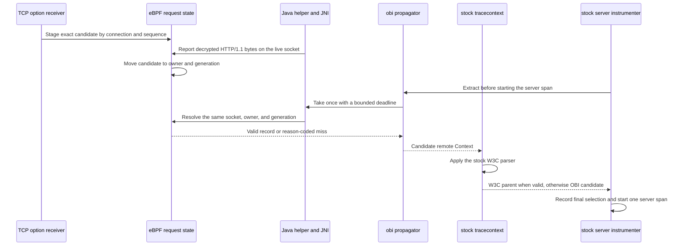

# Java remote-parent bridge

This document defines the version 1 result contract, version 2 fallback request,
and ownership model used to hand
an inbound OBI TCP-propagated parent to an unmodified OpenTelemetry-compatible
Java agent. The initial scope is an HTTP/1.1 server request received through
Java TLS instrumentation. HTTP/2 and other multiplexed protocols are not
supported by this contract.

The correctness invariant is strict: the bridge returns the parent owned by
the current request or no parent. It never returns a parent owned by another
request.

## Components and sequence

1. The sending OBI TCP option carries the exact trace ID, span ID, and trace
   flags of the outbound proxy span.
2. The receiving TCP sockops program validates and stages that candidate by
   connection. A second unconsumed candidate for the same connection marks the
   connection ambiguous instead of replacing the first candidate.
3. The existing Java TLS receive advice synchronously reports decrypted bytes
   before it returns them to the HTTP implementation.
4. When OBI recognizes an HTTP/1.1 server request, it moves the raw TCP
   candidate to the current Java logical execution identity. This is separate
   from both `incoming_trace_map` and the public `traces_ctx_v1` map.
5. Before starting its normal server span, the Java agent invokes the ordered
   propagator list. The `obi` propagator performs one synchronous bridge take
   and creates a remote `SpanContext` only for a valid version 1 record.
6. The stock `tracecontext` propagator runs after `obi`. A valid W3C header
   replaces the OBI candidate. An absent or invalid header leaves the OBI
   candidate unchanged. `baggage` continues to use the stock implementation.

The required order is:

```text
OTEL_PROPAGATORS=obi,tracecontext,baggage
```



The extension wraps the completed stock composite only to compare the final
selected `Span` object with the OBI candidate and increment the fixed
`discard_standard` diagnostic. It does not inspect carrier bytes or duplicate
the stock W3C parser. The transport value has already been resolved by the
one-shot take in either branch.

The extension is loaded when the JVM starts. The OBI helper may attach later;
the extension retries bootstrap-bridge discovery with bounded backoff and does
not permanently cache helper absence.

The primary transport uses paired cgroup `setsockopt` and `getsockopt` hooks.
A connected loopback socket is used only to probe hook availability. For each
decrypted receive, the helper negotiates on the actual application socket by
passing the process capability that OBI generated and supplied at attach time.
The BPF hook accepts and swallows that option only when the capability exactly
matches both the authorized process and its current registration. Negotiation
is stored in `BPF_MAP_TYPE_SK_STORAGE`, then bound to the kernel-derived socket
tuple, network namespace, and request generation by a data-stage
acknowledgement. Context take and discard use the same application socket and
fail closed if any binding changed.

Using the accepted application socket for retrieval intentionally supersedes
issue #20's original cached dummy-socket data path. The dummy socket remains a
capability probe only; it cannot provide the socket-local storage, tuple, or
network-namespace binding needed to authorize a request-owned claim.

## Version 1 result record

Every field has an explicit byte offset. Multibyte integers use little-endian
encoding. Producers zero every reserved byte. Version 1 records are exactly 64
bytes; a different declared or supplied size is malformed.

| Offset | Size | Field | Meaning |
| ---: | ---: | --- | --- |
| 0 | 4 | magic | ASCII `OBIJ` |
| 4 | 2 | ABI version | `1` |
| 6 | 2 | record size | `64` |
| 8 | 1 | status | Result status below |
| 9 | 1 | trace flags | Exact W3C trace-flags byte |
| 10 | 6 | reserved | Zero |
| 16 | 16 | trace ID | Network-order trace ID bytes |
| 32 | 8 | parent span ID | Network-order upstream span ID bytes |
| 40 | 8 | generation | Monotonic request generation |
| 48 | 8 | observation time | Kernel monotonic nanoseconds |
| 56 | 8 | reserved | Zero |

Status values are stable within ABI version 1:

| Value | Name | Meaning |
| ---: | --- | --- |
| 0 | unknown | Uninitialized or unknown result |
| 1 | valid | IDs and flags are available for one request |
| 2 | missing | No state belongs to the current execution |
| 3 | stale | State exceeded its configured lifetime |
| 4 | unsupported | The selected transport is unavailable |
| 5 | malformed | Framing, reserved bytes, or identifiers are invalid |
| 6 | version mismatch | Producer and consumer cannot use one ABI version |
| 7 | ambiguous | Ownership could not be proved |
| 8 | unauthorized | The kernel or fallback server rejected the caller |
| 9 | already consumed | A take or discard already resolved the generation |
| 10 | timeout | A bounded fallback operation expired |
| 11 | overload | The bounded fallback worker limit was reached |
| 12 | transport error | A local transport operation failed |
| 13 | disabled | The bridge is intentionally disabled |

A `valid` record additionally requires a nonzero 16-byte trace ID, a nonzero
8-byte span ID, supported magic/version/size, and zero reserved bytes. All
other statuses fail open and leave the input OpenTelemetry `Context`
unchanged. Version 1 excludes trace state and baggage because the TCP option
does not carry either value. Standard W3C extraction remains authoritative for
them.

Changing the meaning, size, or offset of an existing field requires a new ABI
version. Independently versioned OBI, helper, and extension components
negotiate version 1 and return `version mismatch` rather than guessing.

## Unix fallback request

The fallback uses one fixed 24-byte request and one 64-byte result. Multibyte
fields are little-endian. The Unix stream carries one request per connection:
the server decodes the first complete 24-byte prefix, writes one result, and
closes the connection. A partial request at EOF is malformed. Bytes following
a valid prefix, including another request, are discarded without another map
operation. This prefix framing bounds server allocation independently of the
amount a client attempts to write.

| Offset | Size | Field | Meaning |
| ---: | ---: | --- | --- |
| 0 | 4 | magic | ASCII `OBIQ` |
| 4 | 2 | request version | `2` |
| 6 | 2 | request size | `24` |
| 8 | 1 | operation | `1` take, `2` discard, `3` negotiate |
| 9 | 3 | reserved | Zero |
| 12 | 4 | namespace TID | Calling thread ID visible to the JVM |
| 16 | 8 | process capability | Nonzero unpredictable token generated by OBI and registered by this JVM |

The namespace TID and numeric peer PID are not trusted by themselves. The OBI server obtains
`SO_PEERCRED`, derives the peer's namespace process ID and PID-namespace inode
from `/proc`, and verifies that exactly one thread belonging to that peer has
the requested namespace TID. It then requires the request's unpredictable
64-bit process capability to match the capability OBI authorized for that
exact PID-namespace process and the value the JVM registered in BPF. The server
revalidates both values before resolving the generation. This prevents a
buffered request or cached thread identity from authenticating a later process
that reused the same numeric PID. An unrelated process therefore cannot select
a victim PID or TID. A compromised instrumented JVM can consume its own request
state; that is an accepted boundary because the JVM necessarily receives that
context.

Before parsing or resolving a request, the server applies a fixed one-second
admission window capped at 16,384 requests globally and 4,096 requests for one
peer PID. The peer counter table holds at most 16,384 PIDs and is cleared when
the window advances. Requests beyond any limit return `overload` without
resolving an identity or accessing the one-shot maps. Independent concurrency
and deadline limits continue to bound work admitted inside the rate window.

The socket parent is a real OBI-owned directory with mode `0750` and the
configured group. The socket uses mode `0660`. The Java helper verifies the
path is a socket and requires its peer UID to equal the OBI UID supplied during
attach. `socket_group_id: -1` selects OBI's effective group; a different group
must already own the shared parent directory. Processes in that group can
connect but cannot replace the endpoint. The OBI UID, including host root when
OBI runs as root, remains trusted.

## Ownership and cleanup

The authoritative identities and transitions are:

| State | Key/owner | Transition | Cleanup |
| --- | --- | --- | --- |
| TCP candidate | Sorted connection tuple | Valid inbound TCP option | HTTP parse take, ambiguity, LRU eviction, restart |
| Java request | PID namespace, process ID, logical TID | Parsed Java TLS HTTP/1.1 request | Take, discard, completion, stale sweep, exact process retirement, restart |
| Task handoff | Process, PID namespace, opaque submission token | Java submission capture | Exact one-shot link, cancellation, rejection, stale sweep, bounded-map eviction |
| Virtual thread | Stable virtual-thread identity across carrier mounts | Mount translates the carrier to the virtual-thread ID | Take, discard, virtual-thread termination, bounded-map eviction, restart |
| Consumed | Original Java request key and generation | Atomic take or discard | TTL sweep, bounded-map eviction, restart |

Each Java request record contains a generation and observation time. Take and
discard compete for a generation-specific claim-map entry, making the result
one-shot across both transports. A second caller sees `already consumed`.
Executor submission captures the exact owner and generation under a nonzero,
per-JVM token. Execution consumes that token once, including when submission
and execution use the same carrier thread, and installs a flattened link for
the child. Cancellation, rejection, duplicate task-object submission, missing
tokens, generation change, and post-link validation all fail closed. Legacy
thread links remain available to existing instrumentation but cannot select a
remote parent while this bridge is enabled. A stale task link, missed virtual
thread ownership, or multiple candidates produces `ambiguous` or a miss. It
does not choose one candidate.

An ordinary virtual-thread unmount removes only the carrier-to-virtual-thread
translation. Logical request and task ownership remains keyed by the stable
virtual-thread ID so parking and remounting cannot drop or reassign it.

Take and discard share the same one-shot claim. A successful discard returns a
`missing` record because it intentionally returns no context bytes; the
`discard/valid` diagnostic counter records successful resolution. A repeated
take or discard returns `already consumed`.

Every active request also has a non-evicting generation-index entry containing
its process identity, registered capability, and observation time. The state, claim,
and ambiguity maps remain `HASH` maps: eviction cannot erase a one-shot claim
or resurrect an ambiguous generation. A userspace sweep revalidates the exact
owner, generation, capability, and map value before deleting stale state,
connections, fallback records, owners, claims, ambiguity markers, task links,
handoffs, and handoff-claim tombstones. Cleanup keeps the generation claim
through index and owner deletion, so a concurrent publisher cannot reuse the
owner slot before cleanup releases it.

The shared bridge object observes `sched_process_exit` and records retirement
only when the process's last thread exits. A retirement key includes the full
PID-namespace process identity and the unpredictable process capability. The
sweeper uses that key to remove request generations from that JVM while
preserving state registered by a later process that reused the same numeric
PID. Reusable-key virtual-thread maps are not deleted asynchronously: every
lookup revalidates the capability, and their LRU bounds stale entries
until overwrite or eviction. This avoids deleting a newly published mapping
after rapid PID, carrier, or virtual-thread-ID reuse. Process deletion
notifications trigger an immediate sweep; a bounded periodic sweep handles
missed notifications and TTL expiry. All lifecycle maps have fixed maximum
sizes.

Sequential HTTP/1.1 keepalive requests are supported because each parsed
request creates and resolves a generation. Split reads may accumulate until a
request is recognizable. When pipelined/coalesced data makes the connection to
request mapping ambiguous, all affected candidates are dropped. This may
disconnect a trace but cannot attach a request to the wrong trace. HTTP/2 needs
a stream identity and is explicitly unsupported.

OBI restart removes unpinned process state and reopens the fallback endpoint.
The helper treats transport loss as a miss and may renegotiate after bounded
backoff. Renegotiation succeeds only after the JVM re-registers its process
capability. Application request processing never waits beyond the configured
fallback deadline, including time spent acquiring a transport configuration.

## Configuration

The OBI bridge is opt-in:

```yaml
javaagent:
  remote_parent:
    transport: auto
    socket_path: /var/run/obi/java-remote-parent.sock
    socket_group_id: -1
    timeout: 50ms
    ttl: 30s
```

`transport` is one of `disabled`, `auto`, `getsockopt`, or `unix` and defaults
to `disabled`. The extension independently requires
`OTEL_OBI_REMOTE_PARENT_ENABLED=true`; merely placing `obi` in the propagator
list does not enable native retrieval.

TCP senders use the legacy 26-byte option while the bridge is disabled and the
27-byte exact-flags option while it is enabled. New receivers accept both, but
the bridge accepts only the exact-flags form. Upgrade receivers first with the
bridge disabled, then enable the bridge across senders. Disable it before
downgrading during rollback; old receivers are not required to understand the
27-byte option.

Diagnostics use only bounded transport, operation, status, and lifecycle
values. They never include trace IDs, span IDs, headers, bodies, credentials,
or caller-supplied identifiers. The bootstrap bridge exposes its fixed-cardinality
Java counters through `RemoteParentBridge.diagnosticsSnapshot()`. The snapshot
separates bridge lookup from take and discard statuses, extraction failures,
provider and extension negotiation, and discards caused by an existing standard
parent. Counter values use lower-case base 36 so the complete bounded snapshot
remains below one KiB at saturation. Failures are logged on the first and
power-of-two occurrences so repeated transport faults do not produce per-request
log volume.

The OBI operation counter has four possible `transport` values (`tcp`,
`getsockopt`, `unix`, and `disabled`), seven possible `operation` values
(`stage`, `take`, `discard`, `negotiate`, `select`, `cleanup`, and `evict`), and
fourteen fixed ABI status values. Its absolute Cartesian cardinality bound is
therefore 392, while the implementation emits only the meaningful
combinations. `auto` is never a metric label; selection records the concrete
transport. Failures before a fallback request can be decoded are reported as
`negotiate`, so malformed or unauthenticated input cannot introduce another
operation label. Cleanup and fallback-map eviction are emitted as counted
`tcp` lifecycle operations and never contain map keys. The Java snapshot has
48 fixed keys: twenty configuration, registration, lookup, extraction, and
trace-flag counters plus take and discard counters for each of the fourteen
statuses. Neither surface derives a label or key from request data.

The transport rationale and fallback gates are recorded in
[ADR 001](adr/001-java-remote-parent-transport.md).
