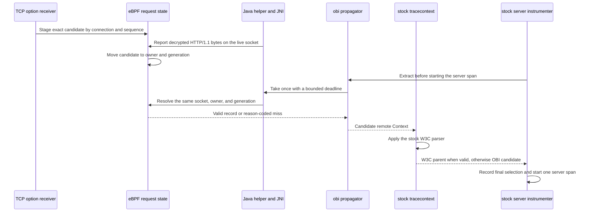

# Java remote-parent bridge

This document defines the version 1 result contract, version 2 fallback request,
and ownership model used to hand
an inbound OBI TCP-propagated parent to an unmodified OpenTelemetry-compatible
Java agent. The initial scope is an HTTP/1.1 server request received through
Java TLS instrumentation. HTTP/2 and other multiplexed protocols are not
supported by this contract.

The correctness invariant is strict: the bridge returns the parent owned by
the current request or no parent. It never returns a parent owned by another
request.

## Components and sequence

1. The sending OBI TCP option carries the exact trace ID, span ID, and trace
   flags of the outbound proxy span.
2. The receiving TCP sockops program validates and stages that candidate by
   connection. A second unconsumed candidate for the same connection marks the
   connection ambiguous instead of replacing the first candidate.
3. The existing Java TLS receive advice synchronously reports decrypted bytes
   before it returns them to the HTTP implementation. `SSLEngine` correlation
   prefers the exact connection scoped by the current Netty operation. The
   generic `SocketChannel` fallback uses the exact `ByteBuffer` object from a
   verified positive read; it never derives ownership from attacker-controlled
   ciphertext. Duplicate and sliced buffer objects therefore miss rather than
   aliasing their backing storage. The weak, bounded identity map does not retain
   application buffers. Session-owner and marker caches likewise use bounded weak
   identity keys so custom TLS engines and their defining class loaders can be
   reclaimed. Capacity saturation rejects new identities; correlation fails
   closed and an unrecorded marker remains eligible for retry. Marker attempts are
   reserved atomically against the exact connection-owner generation before JNI,
   so concurrent and failed calls still respect the bounded burst and retry
   interval. A positive socket read beginning in fresh-fill state (position zero
   with the full capacity writable) starts a new ownership generation, allowing
   frameworks to reuse a drained pooled buffer. Reuse with retained ciphertext or
   a concurrent claim remains ambiguous. A tentative handoff is claimed once only
   after an established session consumes ciphertext and advances a destination
   buffer with plaintext. Socket cleanup invalidates every outstanding handoff and
   cached session owner for the exact tuple and file descriptor. Conflicts and
   stale generations fail closed. The ownership contract requires exclusive
   mutable access to an exact `ByteBuffer` from socket read through its
   corresponding unwrap or release. A buffer can cross threads with a happens-before
   handoff, but concurrent mutation or reuse of a live alias across connections is
   unsupported by both this correlation and `ByteBuffer` itself.
4. When OBI recognizes an HTTP/1.1 server request, it moves the raw TCP
   candidate to the current Java logical execution identity. This is separate
   from both `incoming_trace_map` and the public `traces_ctx_v1` map.
5. Before starting its normal server span, the Java agent invokes the ordered
   propagator list. The `obi` propagator performs one synchronous bridge take
   and creates a remote `SpanContext` only for a valid version 1 record.
6. The stock `tracecontext` propagator runs after `obi`. A valid W3C header
   replaces the OBI candidate. An absent or invalid header leaves the OBI
   candidate unchanged. `baggage` continues to use the stock implementation.

The required order is:

```text
OTEL_PROPAGATORS=obi,tracecontext,baggage
```



The extension wraps the completed stock composite only to compare the final
selected `Span` object with the OBI candidate and increment the fixed
`discard_standard` diagnostic. It does not inspect carrier bytes or duplicate
the stock W3C parser. The transport value has already been resolved by the
one-shot take in either branch.

The extension is loaded when the JVM starts. The OBI helper may attach later;
the extension retries bootstrap-bridge discovery with bounded backoff and does
not permanently cache helper absence.

The primary transport uses paired cgroup `setsockopt` and `getsockopt` hooks.
A connected loopback socket is used only to probe hook availability. For each
decrypted receive, the helper negotiates on the actual application socket by
passing the process capability that OBI generated and supplied at attach time.
The BPF hook accepts and swallows that option only when the capability exactly
matches both the authorized process and its current registration. Negotiation
is stored in `BPF_MAP_TYPE_SK_STORAGE`, then bound to the kernel-derived socket
tuple, network namespace, and request generation by a data-stage
acknowledgement. Context take and discard use the same application socket and
fail closed if any binding changed.

Using the accepted application socket for retrieval intentionally supersedes
issue #20's original cached dummy-socket data path. The dummy socket remains a
capability probe only; it cannot provide the socket-local storage, tuple, or
network-namespace binding needed to authorize a request-owned claim.

## Version 1 result record

Every field has an explicit byte offset. Multibyte integers use little-endian
encoding. Producers zero every reserved byte. Version 1 records are exactly 64
bytes; a different declared or supplied size is malformed.

| Offset | Size | Field | Meaning |
| ---: | ---: | --- | --- |
| 0 | 4 | magic | ASCII `OBIJ` |
| 4 | 2 | ABI version | `1` |
| 6 | 2 | record size | `64` |
| 8 | 1 | status | Result status below |
| 9 | 1 | trace flags | Exact W3C trace-flags byte |
| 10 | 6 | reserved | Zero |
| 16 | 16 | trace ID | Network-order trace ID bytes |
| 32 | 8 | parent span ID | Network-order upstream span ID bytes |
| 40 | 8 | generation | Opaque nonzero per-CPU request token; not globally ordered |
| 48 | 8 | observation time | Kernel monotonic nanoseconds |
| 56 | 8 | reserved | Zero |

Status values are stable within ABI version 1:

| Value | Name | Meaning |
| ---: | --- | --- |
| 0 | unknown | Uninitialized or unknown result |
| 1 | valid | IDs and flags are available for one request |
| 2 | missing | No state belongs to the current execution |
| 3 | stale | State exceeded its configured lifetime |
| 4 | unsupported | The selected transport is unavailable |
| 5 | malformed | Framing, reserved bytes, or identifiers are invalid |
| 6 | version mismatch | Producer and consumer cannot use one ABI version |
| 7 | ambiguous | Ownership could not be proved |
| 8 | unauthorized | The kernel or fallback server rejected the caller |
| 9 | already consumed | A take or discard already resolved the generation |
| 10 | timeout | A bounded fallback operation expired |
| 11 | overload | The bounded fallback worker limit was reached |
| 12 | transport error | A local transport operation failed |
| 13 | disabled | The bridge is intentionally disabled |

A `valid` record additionally requires a nonzero 16-byte trace ID, a nonzero
8-byte span ID, a nonzero generation, a nonzero observation time, supported
magic/version/size, and zero reserved bytes. All other statuses fail open and
leave the input OpenTelemetry `Context` unchanged. Version 1 excludes trace
state and baggage because the TCP option does not carry either value. Standard
W3C extraction remains authoritative for them.

Compatibility within the fixed version 1 envelope is explicit:

| Change or input | Version 1 behavior |
| --- | --- |
| Unknown trace-flag bits | Preserved; only the standard sampled bit changes OpenTelemetry sampling state |
| Supplied byte length other than 64 | `malformed`, before magic or version interpretation |
| Unknown version in an exactly 64-byte record with valid magic | `version mismatch`, before declared-size interpretation |
| Version 1 record with a declared size other than 64 | `malformed` |
| New status, nonzero reserved bytes, or changed validity rules | Requires a new ABI version |
| Changed field meaning, size, offset, byte order, or added trace state/baggage | Requires a new ABI version |
| Internal transport, lookup, or cleanup changes that preserve the envelope | Compatible without an ABI change |

The extension checks the bootstrap bridge API version before use, and the
bootstrap bridge checks the provider ABI version before installation. Socket
negotiation authenticates the process and accepted socket; it does not translate
result-record versions. JNI and Java validate every returned record. A supplied
length other than 64 is `malformed`. After exact framing and valid magic, an
unknown version returns `version mismatch` before the declared size is checked.
The failing operation is not retried or switched between transports. Either
status marks the native provider unavailable so a later operation may perform
the normal bounded reconfiguration; both transports still expose the same
record contract.

## Unix fallback request

The fallback uses one fixed 24-byte request and one 64-byte result. Multibyte
fields are little-endian. The Unix stream carries one request per connection:
the server decodes the first complete 24-byte prefix, writes one result, and
closes the connection. A partial request at EOF is malformed. Bytes following
a valid prefix, including another request, are discarded without another map
operation. This prefix framing bounds server allocation independently of the
amount a client attempts to write.

| Offset | Size | Field | Meaning |
| ---: | ---: | --- | --- |
| 0 | 4 | magic | ASCII `OBIQ` |
| 4 | 2 | request version | `2` |
| 6 | 2 | request size | `24` |
| 8 | 1 | operation | `1` take, `2` discard, `3` negotiate |
| 9 | 3 | reserved | Zero |
| 12 | 4 | namespace TID | Calling thread ID visible to the JVM |
| 16 | 8 | process capability | Nonzero unpredictable token generated by OBI and registered by this JVM |

The namespace TID and numeric peer PID are not trusted by themselves. The OBI server obtains
`SO_PEERCRED`, derives the peer's namespace process ID and PID-namespace inode
from `/proc`, and verifies that exactly one thread belonging to that peer has
the requested namespace TID. It then requires the request's unpredictable
64-bit process capability to match the capability OBI authorized for that
exact PID-namespace process and the value the JVM registered in BPF. The server
revalidates both values before resolving the generation. This prevents a
buffered request or cached thread identity from authenticating a later process
that reused the same numeric PID. An unrelated process therefore cannot select
a victim PID or TID. A compromised instrumented JVM can consume its own request
state; that is an accepted boundary because the JVM necessarily receives that
context.

Before parsing or resolving a request, the server applies a fixed one-second
admission window capped at 16,384 requests globally and 4,096 requests for one
peer PID. The peer counter table holds at most 16,384 PIDs and is cleared when
the window advances. Requests beyond any limit return `overload` without
resolving an identity or accessing the one-shot maps. Independent concurrency
and deadline limits continue to bound work admitted inside the rate window.

The socket parent is a real OBI-owned directory with mode `0750` and the
configured group. The socket uses mode `0660`. The Java helper verifies the
path is a socket and requires its peer UID to equal the OBI UID supplied during
attach. `socket_group_id: -1` selects OBI's effective group; a different group
must already own the shared parent directory. Processes in that group can
connect but cannot replace the endpoint. The OBI UID, including host root when
OBI runs as root, remains trusted.

## Ownership and cleanup

The authoritative identities and transitions are:

| State | Key/owner | Transition | Cleanup |
| --- | --- | --- | --- |
| Active TLS write | Host PID/TID and thread start time | Native SSL write entry | Matching return, wrapper replacement, thread exit, LRU eviction, restart |
| Provisional TLS request | Sorted connection tuple and process | HTTP/1.1 recognized before native SSL write | Write outcome, transport commit, next-request stale recovery, connection lifecycle, LRU eviction, restart |
| Shared TLS prewrite | Host PID/TID, thread start time, unique handoff ID | Provisional request publishes an exact parent | Write and transport terminal outcomes, LRU eviction, restart |
| TLS socket owner | Socket-local exact handoff key and trace | Exact prewrite reaches `sk_msg` | Option terminal outcome, socket close, stale or malformed recovery, restart |
| TCP candidate | Sorted connection tuple | Valid inbound TCP option | HTTP parse take, ambiguity, LRU eviction, restart |
| Java request | PID namespace, process ID, logical TID | Parsed Java TLS HTTP/1.1 request | Take, discard, completion, stale sweep, exact process retirement, restart |
| Task handoff | Process, PID namespace, opaque submission token, shared one-shot accepted-socket holder | Java submission capture | Exact one-shot link, cancellation, rejection, task-scope restoration, stale sweep, bounded-map eviction |
| Virtual thread | Stable virtual-thread identity across carrier mounts | Mount translates the carrier to the virtual-thread ID | Take, discard, virtual-thread termination, bounded-map eviction, restart |
| Consumed | Original Java request key and generation | Atomic take or discard | TTL sweep, bounded-map eviction, restart |

Each Java request record contains a generation and observation time. Take and
discard compete for a generation-specific claim-map entry, making the result
one-shot across both transports. A second caller sees `already consumed`.
Executor submission captures the exact owner and generation under a nonzero,
per-JVM token. Execution consumes that token once, including when submission
and execution use the same carrier thread, and installs a flattened link for
the child. The corresponding Java task context shares a one-shot accepted-
socket holder. Nested task scopes save and restore holder references while an
atomic claim prevents sibling tasks or restored scopes from reusing the
descriptor. A task with no holder masks stale worker state. Cancellation,
rejection, duplicate task-object submission, missing tokens, generation
change, and post-link validation all fail closed. Legacy thread links remain
available to existing instrumentation but cannot select a remote parent while
this bridge is enabled. A stale task link, missed virtual thread ownership, or
multiple candidates produces `ambiguous` or a miss. It does not choose one
candidate.

An ordinary virtual-thread unmount removes only the carrier-to-virtual-thread
translation. Logical request and task ownership remains keyed by the stable
virtual-thread ID so parking and remounting cannot drop or reassign it.

Take and discard share the same one-shot claim. A successful discard returns a
`missing` record because it intentionally returns no context bytes; the
`discard/valid` diagnostic counter records successful resolution. A repeated
take or discard returns `already consumed`.

Every active request also has a non-evicting generation-index entry containing
its process identity, registered capability, and observation time. The state, claim,
and ambiguity maps remain `HASH` maps: eviction cannot erase a one-shot claim
or resurrect an ambiguous generation. A userspace sweep revalidates the exact
owner, generation, capability, and map value before deleting stale state,
connections, fallback records, owners, claims, ambiguity markers, task links,
handoffs, and handoff-claim tombstones. Cleanup keeps the generation claim
through index and owner deletion, so a concurrent publisher cannot reuse the
owner slot before cleanup releases it.

The shared bridge object observes `sched_process_exit` and records retirement
only when the process's last thread exits. A retirement key includes the full
PID-namespace process identity and the unpredictable process capability. The
sweeper uses that key to remove request generations from that JVM while
preserving state registered by a later process that reused the same numeric
PID. Reusable-key virtual-thread maps are not deleted asynchronously: every
lookup revalidates the capability, and their LRU bounds stale entries
until overwrite or eviction. This avoids deleting a newly published mapping
after rapid PID, carrier, or virtual-thread-ID reuse. Process deletion
notifications trigger an immediate sweep; a bounded periodic sweep handles
missed notifications and TTL expiry. All lifecycle maps have fixed maximum
sizes.

Sequential HTTP/1.1 keepalive requests are supported because each parsed
request creates and resolves a generation. Split reads may accumulate until a
request is recognizable. When pipelined/coalesced data makes the connection to
request mapping ambiguous, all affected candidates are dropped. This may
disconnect a trace but cannot attach a request to the wrong trace. HTTP/2 needs
a stream identity and is explicitly unsupported.

### Outbound TLS prewrite lifecycle

The sender bridge does not consume a ports-only `outgoing_trace_map` value. A
native SSL write entry creates an active identity from the host PID/TID, the
kernel thread start time, and a nonzero handoff ID. Before the write, HTTP
parsing creates a provisional client request and publishes a shared value with
the exact connection, network namespace, SSL pointer, buffer, byte count,
trace, and observation time. `sk_msg` accepts only that identity and records
the exact socket owner before sockops can reserve or write the 27-byte option.
The native write return and sockops callbacks use additive arbitration states,
so every ordering converges on the exact parent or no parent.

Only the exact prewrite path may schedule a TCP traceparent option while this
bridge is enabled. Sockops deletes legacy ports-only option state without
emitting it, even if map pressure removed every active-write, TLS-connection,
provisional-request, and shared-handoff entry. Generic `sk_msg` payload
mutation is also disabled in this mode because, after all TLS markers are lost,
an arbitrary encrypted fragment cannot be proved to be plaintext solely from
HTTP-looking bytes. A request that cannot establish the exact handoff therefore
gets no injected parent. Positive exact-handoff failures retain their
reason-coded diagnostics. Legacy ports-only and socket state is cleared without
an injection outcome because it has no request generation and cannot prove an
exact injection attempt. Packets with no ownership evidence are not mislabeled
as TLS misses. Bridge-disabled deployments retain legacy 26-byte TCP options
and plaintext header injection.

The active-write, TLS-connection, provisional-request, and shared-prewrite
maps are fixed-capacity LRU maps. Their capacity is a physical memory bound;
the configured TTL is a logical eligibility bound, not a promise that an idle
LRU slot is deleted at the TTL instant. Normal returns, terminal sockops
outcomes, socket and thread lifecycle hooks, connection reuse, and restart
remove state. Entries left by a missed return or callback may remain physically
present until reuse or LRU pressure. They cannot be selected after expiry.

If a shared handoff is evicted, its exact lookup is a reason-coded miss and the
socket cannot fall back to a legacy parent. If a provisional local owner is
stranded, a new request blocks through the TTL boundary, records ambiguity
once, then deletes the stale owner and retries publication after the TTL. An
active-write insertion failure is reported as overload. Missing, stale,
malformed, segmented, ambiguous, and overload transport outcomes use fixed
diagnostic labels.

Supported OpenSSL wrapper pairs replace the outer active entry with a fresh
inner identity without reporting an error. Unrecognized nesting is marked
unsafe and cannot publish. A failed, zero-length, short, or oversized native
write poisons the handoff; transport emission is suppressed unless arbitration
proves emission had already become unavoidable. In that case the local request
is retained so userspace never observes a remote parent without the matching
client span.

OBI restart removes unpinned process state and reopens the fallback endpoint.
The helper treats transport loss as a miss and may renegotiate after bounded
backoff. Renegotiation succeeds only after the JVM re-registers its process
capability. Application request processing never waits beyond the configured
fallback deadline, including time spent acquiring a transport configuration.

## Configuration

The OBI bridge is opt-in:

```yaml
javaagent:
  remote_parent:
    transport: auto
    socket_path: /var/run/obi/java-remote-parent.sock
    socket_group_id: -1
    timeout: 50ms
    ttl: 30s
```

`transport` is one of `disabled`, `auto`, `getsockopt`, or `unix` and defaults
to `disabled`. The extension independently requires
`OTEL_OBI_REMOTE_PARENT_ENABLED=true`; merely placing `obi` in the propagator
list does not enable native retrieval.

TCP senders use the legacy 26-byte option while the bridge is disabled. While
it is enabled, only a request-owned TLS prewrite emits the 27-byte exact-flags
option; unowned legacy TCP candidates and generic payload injection fail open.
Enable the bridge only for deployments using the exact TLS sender path. New
receivers accept both, but the bridge accepts only the exact-flags form. Upgrade
receivers first with the bridge disabled, then enable the bridge across
senders. Disable it before downgrading during rollback; old receivers are not
required to understand the 27-byte option.

Diagnostics use only bounded transport, operation, status, and lifecycle
values. They never include trace IDs, span IDs, headers, bodies, credentials,
or caller-supplied identifiers. The bootstrap bridge exposes its fixed-cardinality
Java counters through `RemoteParentBridge.diagnosticsSnapshot()`. The snapshot
separates bridge lookup from take and discard statuses, extraction failures,
provider and extension negotiation, and discards caused by an existing standard
parent. Counter values use lower-case base 36 so the complete bounded snapshot
remains below one KiB at saturation. Failures are logged on the first and
power-of-two occurrences so repeated transport faults do not produce per-request
log volume.

The OBI operation counter has four possible `transport` values (`tcp`,
`getsockopt`, `unix`, and `disabled`), eleven possible `operation` values
(`stage`, `candidate`, `handoff`, `inject`, `take`, `discard`, `negotiate`,
`select`, `cleanup`, `evict`, and `report`), and fifteen fixed status values. Its
absolute Cartesian cardinality bound is therefore 660, while the implementation emits
only the meaningful combinations. `auto` is never a metric label; selection records the
concrete transport. Failures before a fallback request can be decoded are reported as
`negotiate`, so malformed or unauthenticated input cannot introduce another
operation label. Cleanup and fallback-map eviction are emitted as counted
`tcp` lifecycle operations and never contain map keys. A `tcp/report/valid`
marker is emitted after each successful BPF counter pass at the configured BPF
metric interval so observers can identify complete publications. The Java snapshot has
50 fixed keys: twenty-two configuration, registration, lookup, extraction,
trace-flag, and decrypted-read counters plus take and discard counters for each
of the fourteen statuses. Neither surface derives a label or key from request
data.

The transport rationale and fallback gates are recorded in
[ADR 001](adr/001-java-remote-parent-transport.md).
